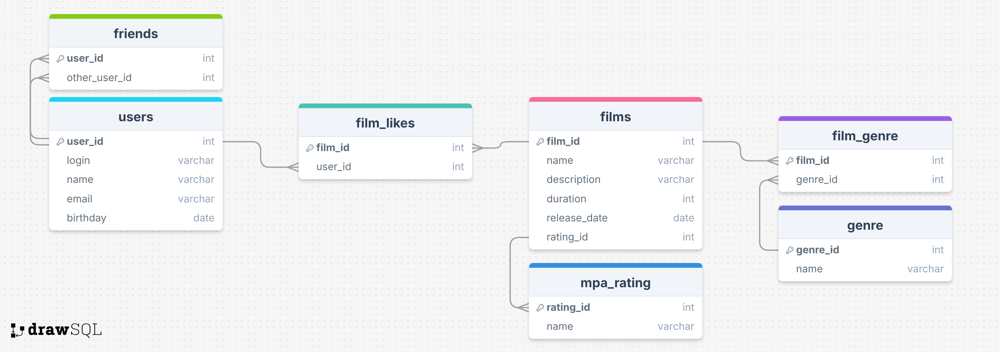

#### Movies

+ GET /films - Get all movies
+ GET /films/{id} - Get a movie by ID
+ POST /films - Add a movie
+ PUT /films - Update the movie
+ DELETE /films/{id} - Delete a movie

#### Users

+ GET /users - Get all users
+ GET /users/{id} - Get a user by ID
+ POST /users - Add a user
+ PUT /users - Update the user
+ DELETE /users/{id} - Delete a user

#### Likes

+ PUT /films/{id}/like/{userId} - Add a like to a movie
+ DELETE /films/{id}/like/{userId} - Remove a like from a movie

#### Friends

+ GET /users/{id}/friends - Get a list of the user's friends
+ GET /users/{id}/friends/common/{otherId} - Get a list of mutual friends with the user
+ PUT /users/{id}/friends/{friendId} - Add a user as a friend
+ DELETE /users/{id}/friends/{friendId} - Remove a user from friends

#### Popular

+ GET /films/popular?count={limit} - Get the most popular movies

## ER-Diagram

